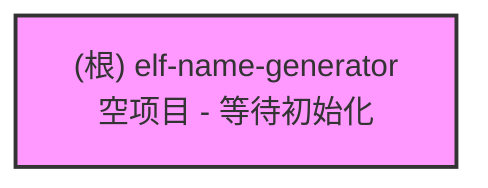

# Elf Name Generator

## 变更记录 (Changelog)

### 2026-01-20 15:51:00 - 初始扫描
- 项目目录为空，等待初始化
- 创建基础文档结构

---

## 项目愿景

Elf Name Generator - 一个用于生成精灵名字的工具/应用程序。

当前状态：项目尚未初始化，目录为空。

## 架构总览

项目尚未创建任何文件或模块。

### 模块结构图

## 模块索引

| 模块路径 | 语言 | 职责 | 状态 |
|---------|------|------|------|
| (无模块) | - | - | 项目未初始化 |

## 运行与开发

项目尚未初始化。建议的初始化步骤：

1. 选择技术栈（Web应用、CLI工具、桌面应用等）
2. 初始化项目结构和依赖管理
3. 创建基础代码框架

### 推荐的技术栈选项

**Web 应用**
- 前端：React/Vue/Svelte + TypeScript
- 后端（可选）：Node.js/Python/Go
- 初始化：`npm create vite@latest` 或 `npx create-react-app`

**CLI 工具**
- Node.js: `npm init` + TypeScript
- Python: `poetry init` 或 `pip` + `pyproject.toml`
- Go: `go mod init`
- Rust: `cargo init`

**桌面应用**
- Electron + React/Vue
- Tauri + Rust + Web前端

## 测试策略

尚未定义。建议根据选择的技术栈配置：
- JavaScript/TypeScript: Jest, Vitest, 或 Playwright
- Python: pytest
- Go: 内置 testing 包
- Rust: 内置 cargo test

## 编码规范

尚未定义。建议配置：
- 代码格式化工具（Prettier, Black, gofmt, rustfmt）
- 代码检查工具（ESLint, Ruff, golangci-lint, Clippy）
- Git hooks（husky, pre-commit）

## AI 使用指引

### 当前项目状态
- 文件总数：0
- 已扫描：0
- 覆盖率：N/A（空项目）

### 与 AI 协作建议

1. **项目初始化**
   - 明确项目类型（Web/CLI/桌面）
   - 选择编程语言和框架
   - 设置项目结构

2. **功能开发**
   - 定义精灵名字生成规则（随机组合、基于规则、AI生成等）
   - 设计用户界面或命令行接口
   - 实现名字生成逻辑

3. **数据与配置**
   - 名字组件库（前缀、后缀、音节等）
   - 配置文件格式
   - 可选的持久化存储

### 下一步建议

1. 决定项目类型和技术栈
2. 初始化项目（运行相应的初始化命令）
3. 创建基础目录结构
4. 重新运行 AI 扫描以更新文档

---

*本文档由 AI 自动生成于 2026-01-20 15:51:00*
