# **UI建议：**

## 1. 去掉v2.0 AI，同时把标题的字体加粗，更直观，Pricing加粗，改成页面里原有的金色

**标题加粗**最好就是现有字体有粗体，没有的话就找找别的可以加粗的 **Serif (衬线体)，也可以参考Gemini生成的那个网页的标题字体**

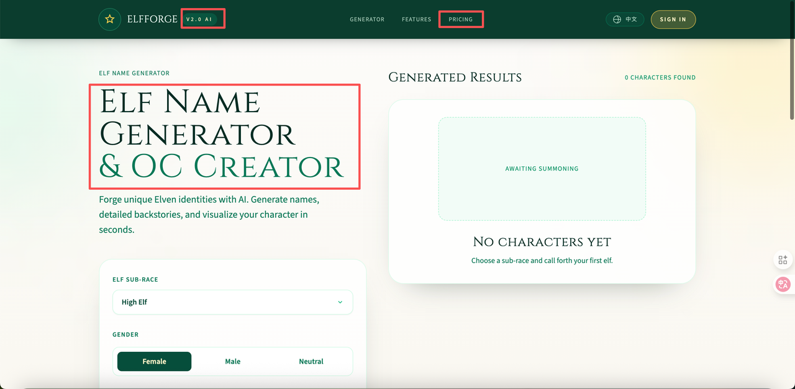

## 2. 调整原始状态下的左右分栏结构为对称，把右侧的结果展示框架给拉长，让视觉平衡

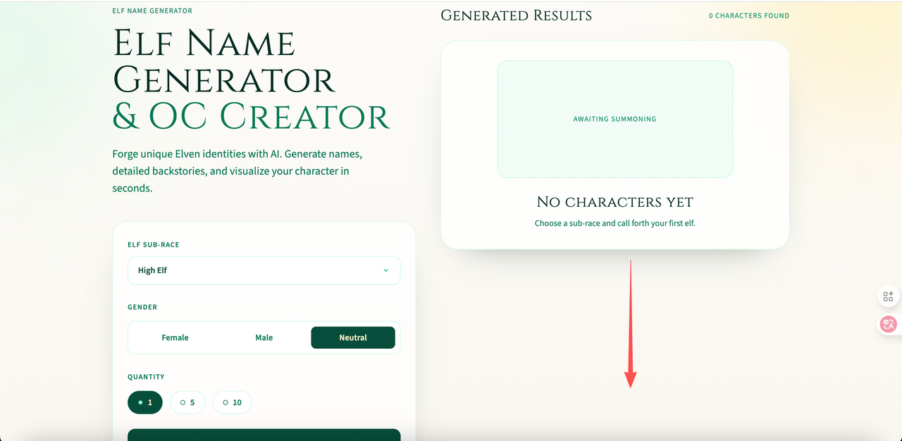

**类似这个：**

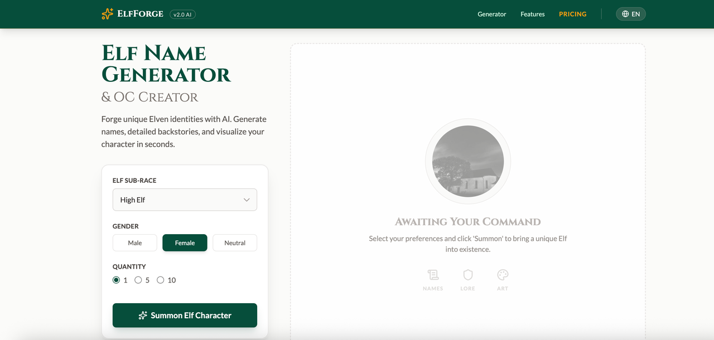

## 3. 生成按钮添加星星/闪亮等符号或者emoji，这里是视觉中心，需要强调存在感

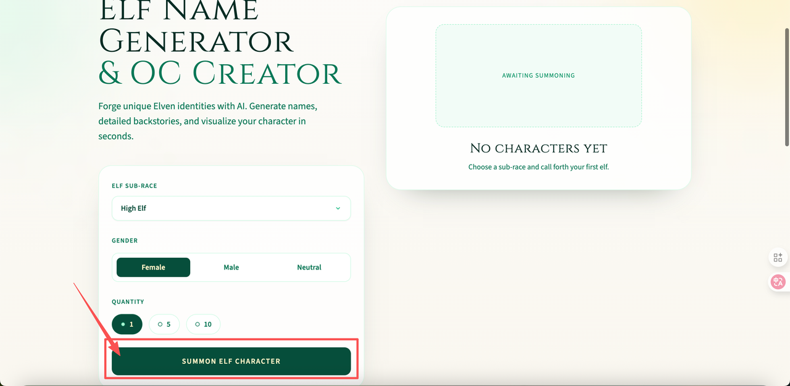

## 4. 结果展示部分同样存在视觉失衡问题

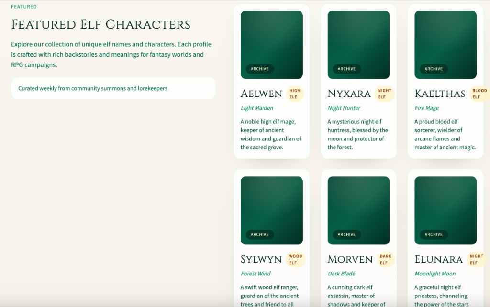

### **修改建议：**

可以试试**杂志风格/非对称布局**

**核心思路：** 打破网格，制造一个“超级焦点”。

* **修改步骤：**

  1. **左侧放一张大图 (Hero Card)：** 不要让左侧全是字。从右侧的卡片里挑出一张“本周最佳”，放大展示在左侧。

     * 左侧结构：标题 -> 描述 -> **一张巨大的高清精灵立绘卡片（带详细背景故事）**。

  2. **右侧做列表 (List)：** 右侧改为 2 列布局，或者更小的卡片列表。

  3. **视觉平衡：** 左侧的一张大图（视觉重量大） = 右侧的一堆小图（视觉重量分散），天平就平了。

* 有 RPG 设定集的那种感觉，视觉冲击力强。

**参考图（仅分区参考布局）：**

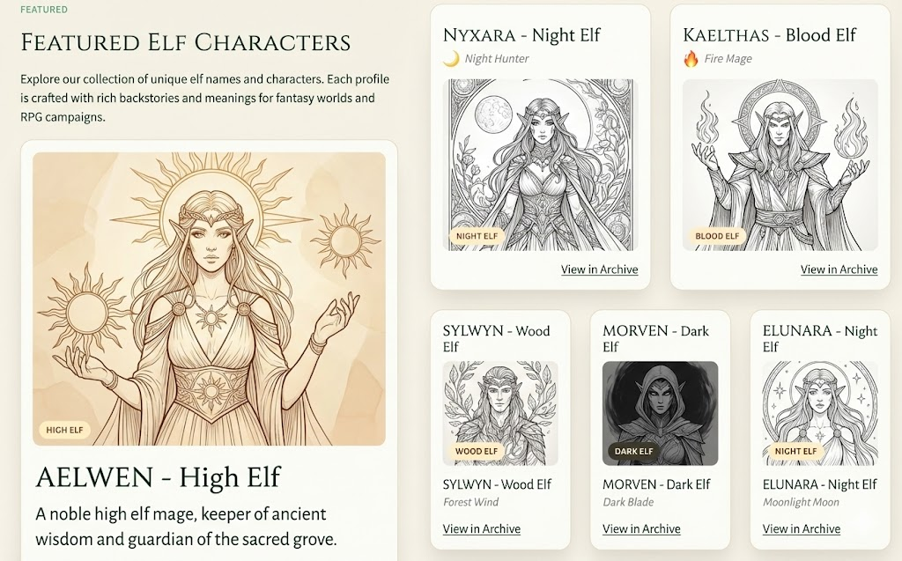

如果难度大和存在bug风险的话，可以考虑一下**上下布局结构**

适用场景： 卡片数量不确定，可能很多，也可能很少。

核心思路： 放弃左右分栏，将标题和分区描述置顶居中。

修改步骤：

* **修改步骤：**

  1. **Header 居中：** 将 "FEATURED", "FEATURED ELF CHARACTERS", 描述文本全部移到页面 **正上方居中** 对齐。

  2. **限制文字宽度：** 描述文本不要撑满全屏，限制 `max-width: 600px` 或 `800px`，保持阅读舒适度。

  3. **网格全宽：** 下方的卡片 Grid 布局改为 **3列** 或 **4列** 铺满宽度。

  4. **背景装饰：** 如果觉得顶部文字区太空，**可以在标题两侧加一些简单的精灵纹样**（Divider）做装饰。

**参考图（网页在iPad移动端的显示情况）**：

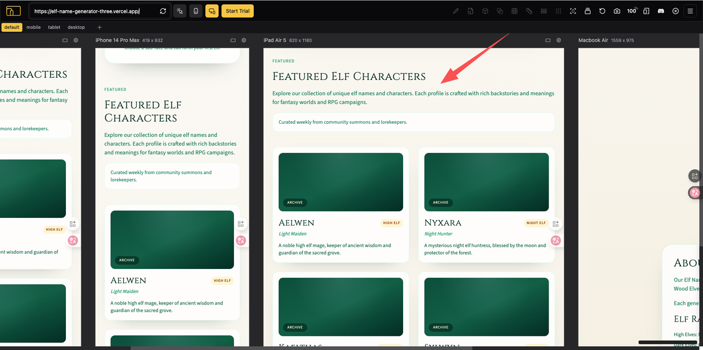

# 其他反馈

## 1. 移动端交互适配

移动端的生成部分是上下布局，可以**设计为点击生成的时候自动往下滑动到生成结果部分**

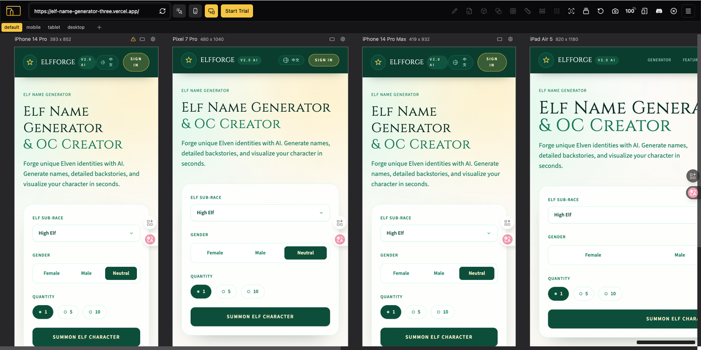

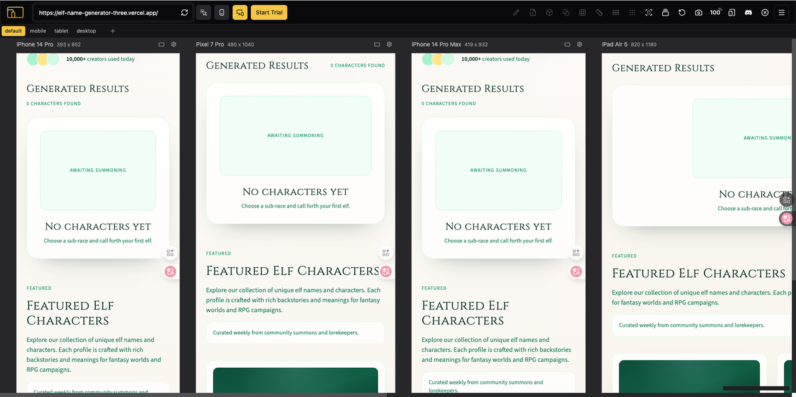

## 2. 生成名字重复问题和OC内容加载不出来

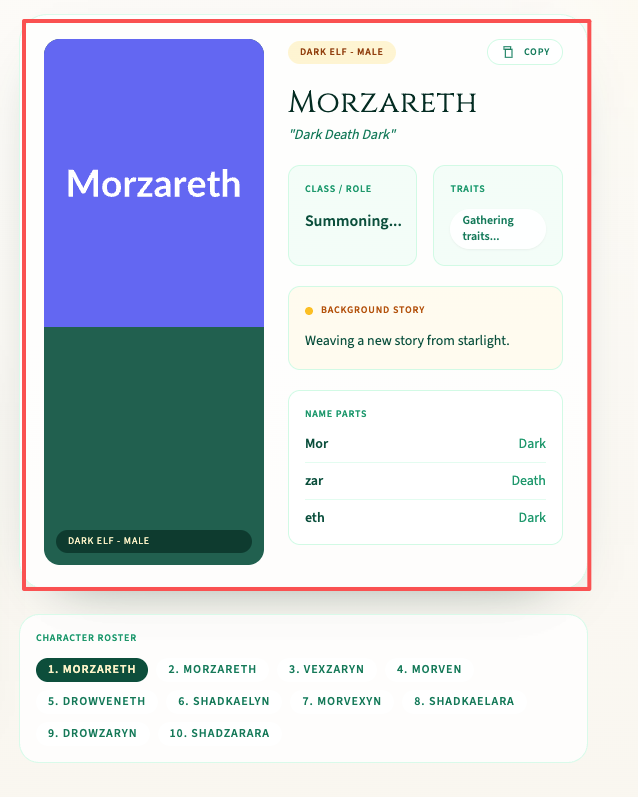

## 3. 异常情况测试

* **异常路径：**

  * **断网测试：**&#x20;

  **进入页面前断网**，把梯子关了模拟无网络环境情况，网页呈现结果状态正常

  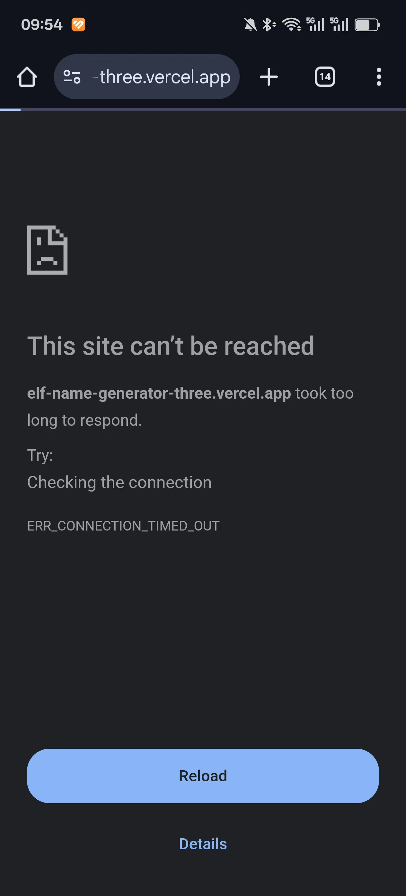

  **进入页面后再断网**，点击生成后按钮是SUMMONING,然后变回原按钮状态。应该为SUMMONING然后发现后台接受不到请求后**弹出网络状态异常等提示弹窗**

  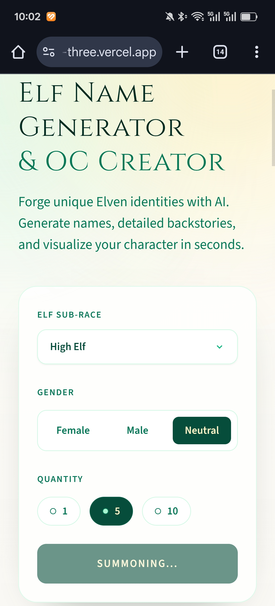

  * **狂点测试：** 在 1 秒内连续点击“生成”按钮 10 次。**需要你帮我做一下**

    * *预期：* 应该在第一次点击后禁用按钮（Disable），防止重复提交请求消耗 Token。

    * *Bug：* 如果没禁用，你会发现后台收到了 10 个请求，浪费了10倍的钱。

## 4. 网页结构设置暂时没找到问题

1. **浏览器标签页为核心目标词**

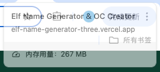

* **网页源代码内容明确，Google爬虫可索引性强；**

语义标签结构清晰，有很直观的层级：

* `<nav>` (导航)

* `<header>` (头部)

* `<section>` (区块)

* `<h1>` -> `<h2>` -> `<h3>` (标题层级分明)

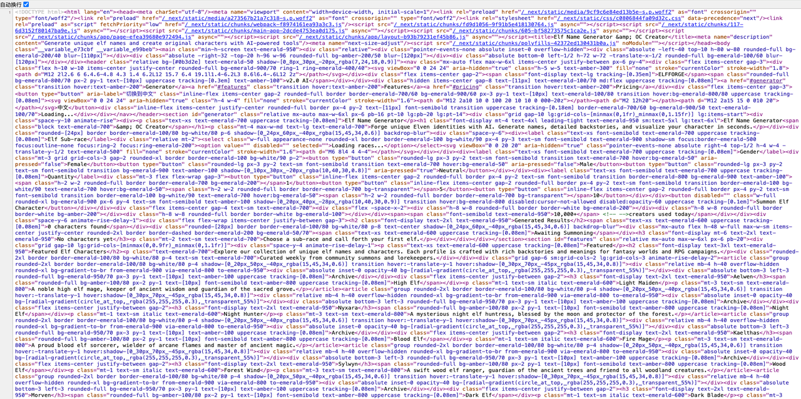

* **页面标题部分的标签为H1，且只有唯一一个H1**

- **核心词：** `Elf Name Generator` 完整出现在 H1 的开头，位置权重高。

- **扩展词：** `& OC Creator` 也被包含在 H1 内。

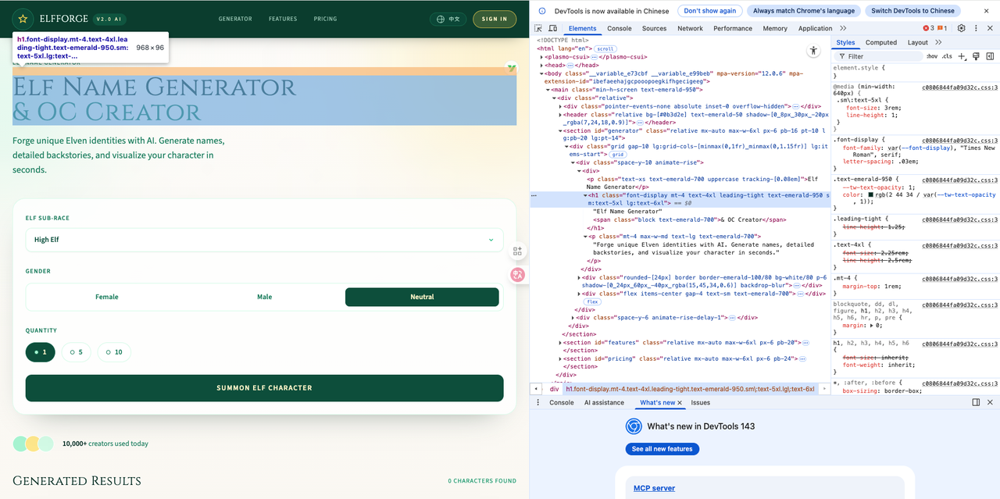

